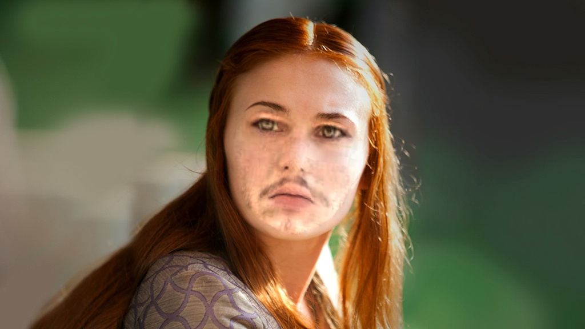

# FaceSwap
[](https://ainize.ai/andrew27lee/FaceSwap?branch=master)

Swap the face from one image onto the face(s) of another image or your own face using Python 3 with OpenCV and dlib.

## Deploy Using Docker
```
$ docker build -t <CUSTOM_IMAGE_NAME> .
$ docker run -d -p 5000:5000 <CUSTOM_IMAGE_NAME>
```

## Examples
<table>
    <thead>
        <tr>
            <td>Source</td>
            <td>Destination</td>
            <td>Result</td>
        </tr>
    </thead>
    <tbody>
        <tr>
            <td></td>
            <td></td>
            <td></td>
        </tr>
        <tr>
            <td></td>
            <td></td>
            <td></td>
        </tr>
        <tr>
            <td></td>
            <td></td>
            <td></td>
        </tr>
    </tbody>
</table>